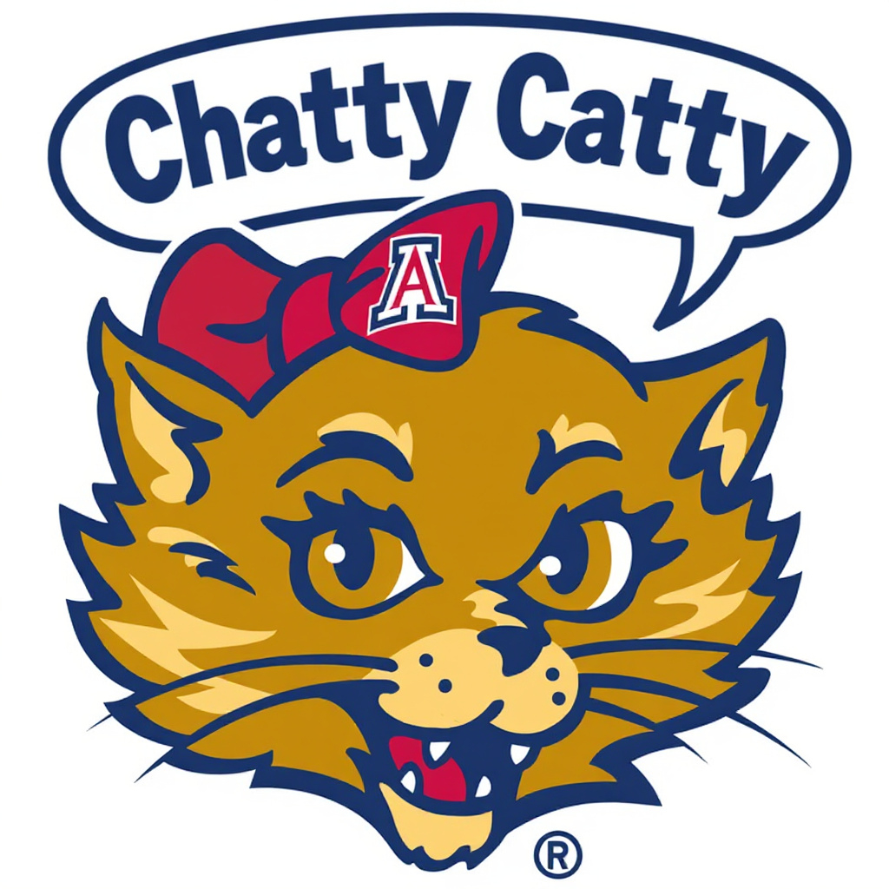

# 🐱 ChattyCatty – Java + Spring RAG System

[](https://github.com/agile-wildcats-082025503/chatty-catty/actions/workflows/tests.yml)

[](https://codecov.io/gh/your-org/chattycatty)

This is an AI chat tool from the Agile Wildcats team for SWFE 503, Fall 2025.

## Introduction

ChattyCatty is a **Retrieval-Augmented Generation (RAG)** stack built with **Java + Spring Boot + React + PostgreSQL (pgvector)**.

It comes with a **Makefile-driven developer workflow** for ingestion, reseeding, QA, and demos.
It runs in Virtual Machines (VMs) powered by Docker.



---

This is an application for serving AI responses to questions related to the University of Arizona's SWFE degrees. 

## Installation

### Requirements

1. [Git Client](http://git-scm.com)
2. [Java Development Kit](https://www.oracle.com/java/technologies/downloads/)
3. Development environment (choose one):
    1. [Visual Studio Code](https://code.visualstudio.com/download)
    2. [JetBrains IntelliJ](https://www.jetbrains.com/idea/download)
    3. [Eclipse](https://www.eclipse.org/downloads/)
4. [Maven](https://maven.apache.org/download.cgi?) (Java builder)
5. [Docker](https://www.docker.com/products/docker-desktop/)
    1. Requires [Windows Subsystem for Linux](https://learn.microsoft.com/en-us/windows/wsl/install)
        1. [Windows fix regarding WSL updates](https://stackoverflow.com/questions/76479583/docker-desktop-requires-a-newer-wsl-kernel-version)
        2. Ensure it's set to run on restart using Settings->General->Start Docker...
6. [Node.js and npm](https://www.geeksforgeeks.org/node-js/how-to-download-and-install-node-js-and-npm/)
    1. Check the "Install the necessary tools" checkbox when installing Node.js (ex: installs Chocolatey on Windows)
7. [Make](https://medium.com/@divyeshpal07/mastering-gnu-make-and-makefiles-the-developers-guide-22df3b97cc0d)
8. [Lombok setup for your IDE](https://projectlombok.org/setup/)

### Building the System
1. Download this codebase using the green button on the top right above that says `[<> Code]`
2. Create an .env file in the project root.
   1. Add an OpenAI api-key with this line: `OPENAI_API_KEY=Insert-Your-Key-here`
   2. Don't check this file into git. Some IDEs will suggest to add it, but the .gitignore file will filter it out.
3. Prepare the environment:
   1. This should be done the first time and repeated whenever maven or npm dependencies are changed.
   ```bash
   # Navigate to the project
   cd chatty-catty

   # Install dependencies
   mvn clean install
   cd frontend
   npm install
   cd ..
   ```
4. Execute the makefile command to spin up docker VMs for the DB, API, and frontend:
   ```bash
   make dev
   ```
   This command builds and starts the VMS:
   1. ragdb: The database
   2. chatty-catty-app - The API tier
   3. chatty-catty-frontend - The UI tier

## Testing It Out
* Open a browser to the following url to view the frontend: http://localhost:3000
* Joke endpoint for verifying the OPENAI API KEY: http://localhost:8080/chat/general?message=Tell%20me%20a%20joke
* View the REST API endpoints for direct API testing using [POSTMAN](https://learning.postman.com/docs/getting-started/overview/) or other integration:
  * View directly in browser http://localhost:8080/swagger-ui.html
  * Download the REST JSON API http://localhost:8080/v3/api-docs
  * Download as yaml file http://localhost:8080/v3/api-docs.yaml

NOTE: Add documents into the docs folder for automatic ingestion into RAG.

---

## 🚀 Quick Start

1. Start dev stack:
   ```bash
   make dev
   ```
2. Ingest docs (requires admin JWT):
   ```bash
   make reseed-logs
   ```
5. Run QA checks:
   ```bash
   make qa-full
   ```

---
### Developer Usage

See the [DEV_COMMANDS](DEV-COMMANDS.md) file for the full list and explanation of Makefile commands.

---

### 🏗️ Tech Stack
* Backend: Java 24 + Spring Boot 6 + JPA
* Database: PostgreSQL + pgvector
* Frontend: React + Axios
* Ingestion: PDF/TXT/Markdown parsing + OpenAI embeddings
* Dev Tools: Docker Compose + Makefile
* The VMs are used for the system:
  * ragdb - The database
  * chatty-catty-frontend - The UI tier
  * chatty-catty-app - The API tier

### 🎉 Demo-Ready
ChattyCatty is developer-friendly and presentation-ready:

* ASCII art banners in demo/dev commands
* One-command demo setup (make demo or make demo-auto)
* Built-in QA + monitoring

---

## 🐱 Happy chatting with ChattyCatty!